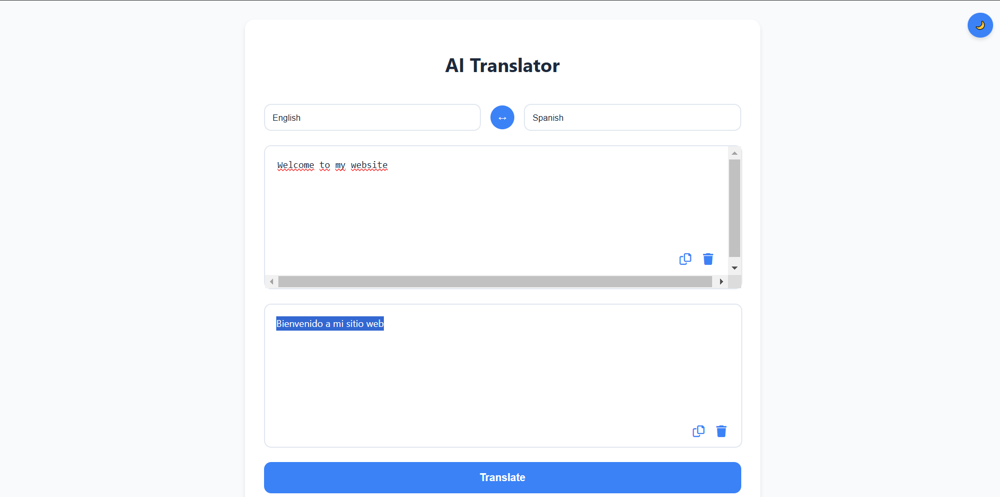

# Translator App

The **Translator App** is a React-based application that provides text translation functionality using an AI-powered backend service. Users can input text in one language and translate it into another language, with support for multiple languages and themes (light/dark mode).

## 🚀 Features
- Translate text between multiple languages.
- Light and dark mode support.
- Language swapping with a single click.
- Copy and clear functionality for both input and output fields.

## 🛠️ Technologies Used
- **Frontend**: React, Axios
- **Backend**: Node.js (API for translation)
- **Styling**: CSS (with custom themes)
- **API**: AI-powered translation service (using Hugging Face API)

## 🔧 How It Works
The app utilizes the **facebook/nllb-200-distilled-600M** model from Hugging Face for translation. This model provides efficient and high-quality translations for over 200 languages. The backend communicates with the Hugging Face API to perform translations, ensuring accurate and fast results.

## ⚙️ Installation

Follow these steps to run the project locally:

### 1. Clone the Repository
```bash
git clone https://github.com/hakanberkiten/Translate-App.git
cd Translate-App
```

### 2. Install Dependencies
#### For the frontend:
```bash
cd translate-app
npm install
```

#### For the backend:
```bash
cd backend
npm install
```

### 3. Add Environment Variables
Create a `.env` file in the root directory and provide your API keys. Example:
```plaintext
API_KEY=your-api-key
API_URL=https://api.translation-service.com
```

### 4. Run the Application
#### Start the backend server:
```bash
cd backend
npm start
```

#### Start the frontend:
```bash
cd translate-app
npm start
```

The app will be available at `http://localhost:3000`.

## 🖼️ Screenshots



## 📝 License
This project is licensed under the MIT License. See the `LICENSE` file for details.

## 🤝 Contributing
Contributions, issues, and feature requests are welcome! Feel free to check the [issues page](https://github.com/hakanberkiten/Translate-App/issues).
